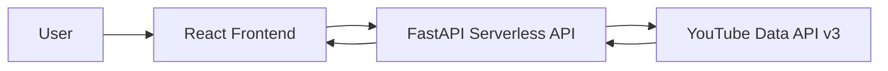
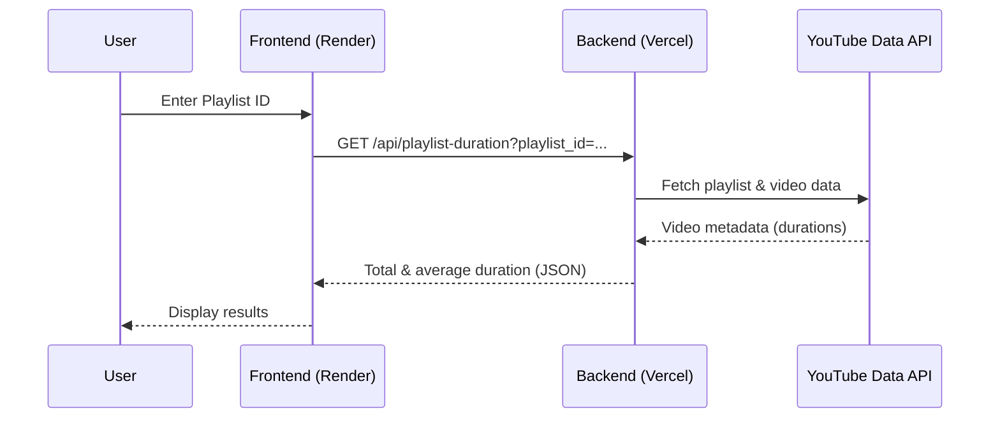

# YouTube Playlist Duration Checker

A web application that calculates the **total and average duration of a YouTube playlist** using the **YouTube Data API v3**.  
Built with a modern **React + FastAPI serverless architecture**.

---

## 🎬 Demo Video

---

## Usage

1. Open the frontend application in your browser.  
   https://youtube-playlist-duration-checker.onrender.com/

2. Enter a valid YouTube **Playlist ID** in the input field.

3. Click the **Check Duration** button.

4. The application will display:
   - Total playlist duration
   - Average duration per video
   - Video-wise details including title and duration

---

## 🌐 Live Deployment

- **Frontend:** https://youtube-playlist-duration-checker.onrender.com/
- **Backend API:** https://youtube-playlist-duration-checker.vercel.app/api/playlist-duration
- **GitHub Repository:** https://github.com/vijayvardhan-killi/Youtube-Playlist-Duration-Checker

---

## 📌 Overview

YouTube Playlist Duration Checker helps users **know the total time commitment** of a YouTube playlist before watching it.

Users provide a **YouTube Playlist ID**, and the application:
- Fetches all videos in the playlist
- Parses individual video durations
- Calculates:
  - Total playlist duration
  - Average video duration
  - Video-wise details

---

## ✨ Features

- 📊 Total playlist duration calculation  
- ⏱ Average video duration  
- 📃 Video-wise breakdown (title, thumbnail, duration)  
- ⚡ FastAPI backend deployed as serverless functions  
- 🎨 Clean and responsive React UI  
- ☁ Fully deployed and publicly accessible  

---

## 🧱 Tech Stack

### Frontend
- React (Vite)
- JavaScript
- Tailwind CSS
- Deployed on **Render**

### Backend
- FastAPI (Python)
- YouTube Data API v3
- Deployed as **Vercel Serverless Functions**

---

## 🔌 External API Used

### 📺 YouTube Data API v3
Used to:
- Fetch playlist items
- Fetch video metadata
- Retrieve ISO-8601 duration strings

Official docs:  
https://developers.google.com/youtube/v3

---

## 🏗 System Architecture

### High-Level Flow

### Request Flow

---
## Contributing
Feel free to submit issues or pull requests to improve this project.
