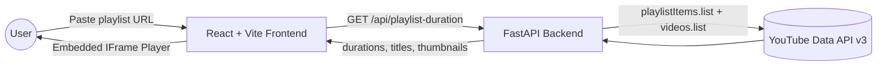
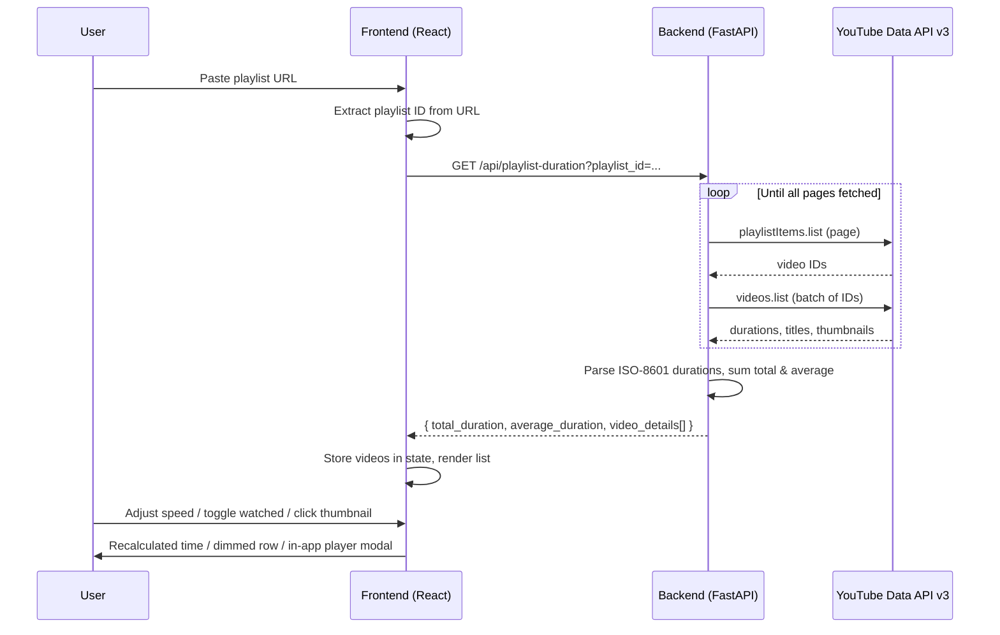

# YouTube Playlist Duration Checker

Paste a YouTube playlist link and instantly see how much time it'll take to watch — total duration, per-video breakdown, playback-speed-adjusted estimates, an in-app player, and watched-progress tracking. No YouTube account or API key required on your end.

---

## Demo

https://github.com/user-attachments/assets/3b4cf867-22a4-41dc-a130-8d80bbef8c6f

**Live app:** https://youtube-playlist-duration-checker.onrender.com/

---

## Features

- **Total & average duration** — sums every video in the playlist, handles playlists of any length via pagination
- **Playback-speed adjustment** — recalculates total time at 1.25x, 1.5x, 2x, etc., so you know how long it *actually* takes to watch
- **In-app player** — click any thumbnail to watch inside a modal, no tab-switching to YouTube
- **Watched tracking** — mark videos as watched; watched items dim and can be filtered out
- **Filters & sorting** — exclude Shorts, skip watched videos, search and sort the list
- **Safe API key handling** — the YouTube Data API key never touches the browser; all calls are proxied through the backend

---

## Architecture


```mermaid
flowchart LR
    User((User)) -->|Paste playlist URL| Frontend[React + Vite Frontend]
    Frontend -->|GET /api/playlist-duration| Backend[FastAPI Backend]
    Backend -->|playlistItems.list + videos.list| YouTubeAPI[(YouTube Data API v3)]
    YouTubeAPI --> Backend
    Backend -->|durations, titles, thumbnails| Frontend
    Frontend -->|Embedded IFrame Player| User
```

**Why a backend at all, if this could be a static site?**
The YouTube Data API key has a public request quota. Calling it directly from the browser would expose the key to anyone who opens dev tools and lets them burn your quota. The FastAPI backend acts as a thin proxy: it holds the key server-side, handles playlist pagination internally, and returns only the computed result.

### Request flow


```mermaid
sequenceDiagram
    participant U as User
    participant F as Frontend (React)
    participant B as Backend (FastAPI)
    participant Y as YouTube Data API v3

    U->>F: Paste playlist URL
    F->>F: Extract playlist ID from URL
    F->>B: GET /api/playlist-duration?playlist_id=...
    loop Until all pages fetched
        B->>Y: playlistItems.list (page)
        Y-->>B: video IDs
        B->>Y: videos.list (batch of IDs)
        Y-->>B: durations, titles, thumbnails
    end
    B->>B: Parse ISO-8601 durations, sum total & average
    B-->>F: { total_duration, average_duration, video_details[] }
    F->>F: Store videos in state, render list
    U->>F: Adjust speed / toggle watched / click thumbnail
    F->>U: Recalculated time / dimmed row / in-app player modal
```

### Frontend structure

```
frontend/src/
├── pages/Home.jsx              # top-level state: videos, speed, filters
├── components/
│   ├── Input.jsx                # URL input + speed/filter controls
│   ├── Results.jsx              # list container, sorting/filtering
│   ├── VideosCard.jsx           # per-video row: thumbnail, duration, watched toggle
│   └── VideoPlayerModel.jsx     # embedded YouTube IFrame player modal
├── hooks/
│   ├── useFilteredVideos.js     # applies search/sort/exclude-shorts/skip-watched
│   └── useVideoStats.js         # derives total/average from current video list
├── services/api.js              # calls the FastAPI backend
└── utils/
    ├── format.js                 # seconds -> "1h 23m 45s"
    └── youtube.js                 # playlist ID / thumbnail-based video ID extraction
```

### Backend structure

```
Backend/app/
├── main.py       # FastAPI app, single route: GET /api/playlist-duration
└── youtube.py    # YouTube Data API client, pagination, ISO-8601 duration parsing
```

---

## Tech Stack

| Layer      | Tech                                              |
|------------|----------------------------------------------------|
| Frontend   | React (Vite), Tailwind CSS                         |
| Backend    | FastAPI (Python), google-api-python-client          |
| External API | YouTube Data API v3                             |
| Hosting    | Frontend: Render · Backend: Vercel Serverless Functions |

---

## Usage

1. Open the [live app](https://youtube-playlist-duration-checker.onrender.com/)
2. Paste a YouTube playlist URL (must contain `?list=...`)
3. Adjust playback speed or filters as needed
4. Click any video to watch it in-app, or mark it watched to track progress

---

## Running locally

**Backend**
```bash
cd Backend
pip install -r requirements.txt
echo "YOUTUBE_API_KEY=your_key_here" > .env
uvicorn app.main:app --reload
```

**Frontend**
```bash
cd frontend
npm install
npm run dev
```

---

## Known limitation

Watched status and the current video list live in React state only — refreshing the page clears them. There's no persistence layer (localStorage or database) yet.

---

## Contributing

Issues and pull requests are welcome.
